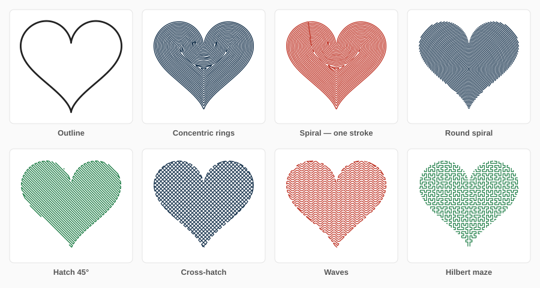
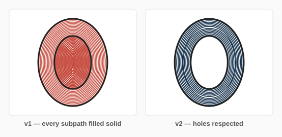
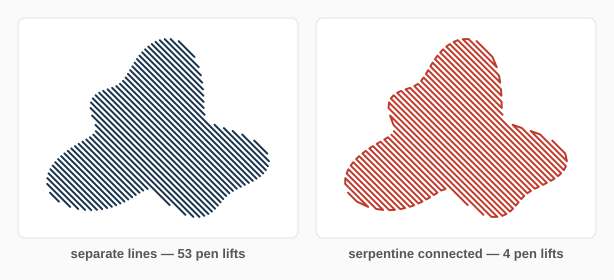
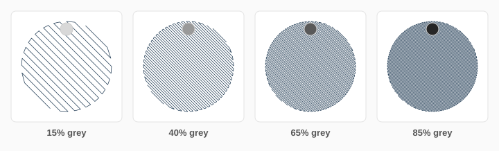
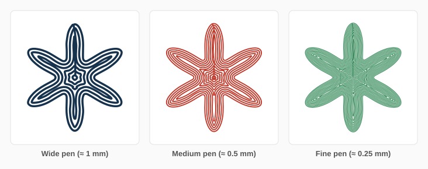
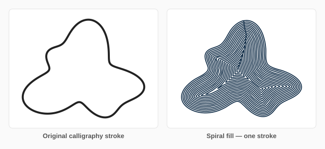

# Pen Plotter Fill

[](LICENSE)
[](https://inkscape.org)
[](https://www.python.org)
[](#installation)
[](https://github.com/iret33/inkscape-pen-fill/actions/workflows/test.yml?query=branch%3Amain)

An Inkscape extension that turns closed shapes into **plotter-ready pen fills**. Pick a pen width, pick a fill style, apply — the shape becomes strokes your plotter can actually draw, spaced exactly one pen line apart.



Seven fill styles, real hole support, serpentine stroke joining, plot-order optimization, and pen-lift statistics — pure Python, **no pip install**, drop three files into your extensions folder and go.

---

## What's new in v2.0

v2 is a ground-up rewrite of the geometry engine:

- 🕳️ **Holes finally work.** Subpaths are treated as one region with true even-odd / nonzero winding — donuts, counters of letters, frames all fill correctly. (v1 inked right over them.)
- ✂️ **Shapes that pinch split cleanly.** The new fill engine is built on a signed distance field + marching squares, so narrow waists split into separate fill islands instead of breaking the offset.
- 🌀 **Seven fill styles** (v1 had two): concentric rings, continuous spiral, Archimedean spiral, hatch, cross-hatch, sine waves, Hilbert maze.
- 🐍 **Serpentine joining** — neighbouring hatch lines connect into long continuous strokes. A fill that took 53 pen lifts takes 4.
- 🧭 **Plot-order optimization** — strokes are re-ordered nearest-first and merged when they touch, slashing pen-up travel. Optional stats dialog: ink length, travel, pen lifts, rough plot time.
- 🎨 **Colour-aware fills** — strokes can inherit each shape's fill colour (multi-pen workflows), and *line density from fill tone* turns grey values into hatch density for tonal art.
- 📐 **Output lands in the right place** — fills are inserted next to the source shape, in its layer, with transforms handled exactly. Rectangles, ellipses and stars work without *Object to Path*.
- ⚡ **Fast** — a 15 cm disc at 0.35 mm pen spacing (212 rings) generates in seconds.



---

## Fill styles

| Style | Best for | Pen lifts |
|---|---|---|
| **Concentric rings** | topographic look, logos | one per ring |
| **Spiral** | fastest solid fill, minimal lifts | **~1 per shape** |
| **Round spiral** (Archimedean) | records, mandalas, organic texture | few |
| **Hatch** | classic engraving look, quick plots | few (serpentine) |
| **Cross-hatch** | darker tone, woven texture | few (serpentine) |
| **Waves** (sine) | water, fabric, kinetic texture | few (serpentine) |
| **Hilbert maze** | sci-fi texture, uniform tone without direction | several |





---

## Installation

1. Find your user extensions folder (*Edit ▸ Preferences ▸ System ▸ User extensions*):
   - **Linux / macOS:** `~/.config/inkscape/extensions/`
   - **Windows:** `%APPDATA%\inkscape\extensions\`
2. Copy **`pen_fill.inx`**, **`pen_fill.py`** and **`penfill_core.py`** into it.
3. Restart Inkscape. The extension appears under **Extensions ▸ Pen Plotter ▸ Pen Plotter Fill**.

No pip, no compiler, nothing else.

> Upgrading from v1: delete the old `pen_fill.py`/`pen_fill.inx` first. The menu location moved from *Generate from Path* to the new *Pen Plotter* submenu.

---

## Usage

1. Select one or more closed shapes — paths, rectangles, ellipses, stars, or whole groups. (Text: run *Path ▸ Object to Path* first.)
2. **Extensions ▸ Pen Plotter ▸ Pen Plotter Fill…**
3. On the **Fill** tab:
   - **Pen width (mm)** — your physical pen tip (e.g. `0.3` for a fineliner). Stroke width in the preview equals this, so what you see is what plots.
   - **Line spacing (× pen width)** — `1.0` = strokes touch for solid coverage; `1.5`–`4` gives lighter tone.
   - **Fill style** and **hatch angle**.
   - **Connect neighbouring lines** — serpentine joining (leave on).
   - **Keep ink inside the outline** — insets everything by half a pen width.
   - **Line density from shape fill colour** — darker shapes get denser lines; fill a whole grey-shaded drawing in one apply.
4. **Output** tab: stroke colour (black / from shape / custom), grouping, keep original.
5. **Plot** tab: plot-order optimization, stroke joining tolerance, statistics dialog.
6. Apply.



### Tips from the bench

- **Spiral is the plotter's favourite** — a whole shape in one continuous stroke means no witness marks from pen-down blobs.
- For **brush pens**, set spacing `0.8`–`0.9` so strokes overlap slightly and bands vanish.
- For **tonal work**, give shapes grey fills and switch on *density from fill colour* with hatch or cross-hatch.
- The **stats dialog** (Plot tab) tells you ink length and pen lifts before you commit paper to it.



---

## How it works

- Shapes are flattened to polylines at a tolerance proportional to the pen width, and all subpaths of a path become **one region** with the SVG fill rule (`evenodd`/`nonzero`) — that's what makes holes work.
- **Hatch / cross-hatch / waves**: the region is first *eroded* by half a pen width (so ink can't spill over the outline anywhere), then scanline-clipped with winding-aware interval pairing, then serpentine joining connects neighbouring rows whenever the short bridge between them stays inside.
- **Concentric / spiral / round spiral / Hilbert**: a **signed distance field** is computed on a grid (scanline mask + exact distances near the boundary + a 5×5 chamfer transform, numpy-accelerated when available — Inkscape bundles numpy). Iso-contours extracted with **marching squares** become the rings; they survive holes, splits and merges by construction. Rings are linked into continuous spirals by nearest-point bridging down the containment tree. The Archimedean spiral is centred on the **pole of inaccessibility** (deepest interior point) and clipped against the eroded field.
- Output is re-fitted with **Schneider's cubic-Bezier algorithm** (Graphics Gems, 1990), so smooth fills emit real `C` curves instead of thousand-point polylines.
- A greedy nearest-neighbour pass with endpoint reversal re-orders strokes for the plotter and merges strokes whose ends touch.

---

## Compatibility & limits

- Inkscape **1.1 – 1.4+**, any OS. Python 3.8+. Works with AxiDraw/NextDraw, iDraw, GRBL plotters — anything that consumes SVG.
- Very large shapes with very fine pens get a coarser distance grid (a warning tells you); hatch styles are unaffected.
- A sliver narrower than the pen may stay unfilled along a shape's medial axis — that's the pen physically not fitting, and the engine leaves at most a sub-pen-width gap.
- Open paths are treated as closed (implicit `Z`).

---

## Development

```bash
git clone https://github.com/iret33/inkscape-pen-fill
cd inkscape-pen-fill
python -m venv venv && . venv/bin/activate
pip install --no-deps inkex && pip install lxml numpy cssselect tinycss2 packaging pytest
pytest
```

`penfill_core.py` is pure geometry with zero Inkscape dependencies — import it in your own generative-art scripts if you like. `images/generate.py` regenerates every demo SVG from the real engine.

---

## Contributing

Bug reports with an attached SVG that misbehaves are gold. Feature ideas welcome — flow-field fills and medial-axis finishing strokes are on the roadmap.

## License

[MIT](LICENSE) — do whatever you want with it, attribution appreciated.
