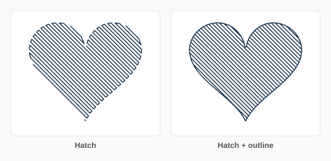

# Pen Plotter Fill

[](LICENSE)
[](https://inkscape.org)
[](https://www.python.org)
[](#install)
[](https://github.com/iret33/inkscape-pen-fill/actions/workflows/test.yml?query=branch%3Amain)

An Inkscape extension that turns closed shapes into **pen strokes your plotter can draw**. Pick a pen width and a fill style, click Apply — the shape is filled with lines exactly one pen width apart.


Seven fill styles, real holes, few pen lifts. Pure Python — **nothing to install**, just copy three files.

---

## Install

1. Open your extensions folder (*Edit ▸ Preferences ▸ System ▸ User extensions*):
   - **Linux / macOS:** `~/.config/inkscape/extensions/`
   - **Windows:** `%APPDATA%\inkscape\extensions\`
2. Copy **`pen_fill.inx`**, **`pen_fill.py`** and **`penfill_core.py`** into it (replace the old ones when upgrading).
3. Restart Inkscape. Find it under **Extensions ▸ Pen Plotter ▸ Pen Plotter Fill**.

## Use

1. Select closed shapes — paths, rectangles, ellipses, stars, clones, or whole groups. (Text: *Path ▸ Object to Path* first.)
2. Open **Extensions ▸ Pen Plotter ▸ Pen Plotter Fill…**
3. Set **Fill style**, **Pen width** (your real pen tip, e.g. `0.3` mm) and **Line spacing** (`1.0` = solid, bigger = lighter).
4. Click **Apply**. Not happy? Change a setting and apply again — the old fill is replaced.

The **Fill** tab has everything you need day to day. The **More** tab holds colour, cross-hatch/wave settings, and what happens on apply.

| Style | Good for | Pen lifts |
|---|---|---|
| **Concentric rings** | topographic look, logos | one per ring |
| **Spiral** | fastest solid fill | **~1 per shape** |
| **Round spiral** | records, mandalas | few |
| **Hatch** | classic engraving look | few |
| **Cross-hatch** | darker tone | few |
| **Waves** | water, fabric | few |
| **Hilbert maze** | even tone with no direction | several |


### Tips

- **Spiral** draws a whole shape in one stroke — no blobs from pen-down.
- Tick **Also draw the outline** for a crisp edge around hatch, wave and maze fills.
- **Brush pens:** spacing `0.8`–`0.9` so strokes overlap and bands disappear.
- **Tonal art:** give shapes grey fills, tick *Darker shapes get denser lines* (More tab), fill everything at once.
- **Show plot statistics** (More tab) tells you ink length, pen lifts and plot time before you use paper.


---

## What's new in v2.1

**New**
- ✏️ **Outline pass** — *Also draw the outline* traces the shape edge once, so hatch fills get a clean border.
- 🔁 **Apply again to replace** — re-applying swaps a shape's old fill for the new one instead of stacking fills. (Untick *Replace the shape's earlier fill* to layer fills on purpose.)
- 🖇️ **Clones** fill in the original's colour.



**Fixed**
- Hatch, cross-hatch and waves with *Keep ink inside* (the default) now really join into long strokes — a disc went from 14 strokes to 2, a donut from 32 to 8.
- Shapes made of **overlapping pieces** (e.g. combined circles) fill as one shape instead of drawing the hidden inside edges.
- **Spiral** on shapes with holes: a donut is 2 strokes instead of 9, and no ring is ever dropped.
- **Waves** no longer cross each other (they used to double-ink the paper).
- **Hilbert maze** keeps the line spacing you set (it was up to 2× too dense).
- Hidden objects, images and earlier fills are no longer filled when you select everything; an object selected twice is filled once.
- Works on **Inkscape 1.1** (v2.0 used a style call that only exists from 1.2 on), and *density from colour* now counts fill opacity.
- Waves are ~5× faster on big shapes.

**Simpler**
- Dialog cut from five tabs to three. Plot-order optimization and grouping are always on (they only ever help), so their switches are gone.


---

## How it works

- All subpaths of a shape become **one region** with the SVG fill rule, so holes work.
- **Hatch / cross-hatch / waves** fill a copy of the shape shrunk by half a pen width, then join neighbouring lines whenever the short bridge stays inside.
- **Rings / spirals / maze** come from a **distance field** of the shape: rings are its contour lines, so they split and merge cleanly around holes and narrow waists.
- Curves are re-fitted as smooth Béziers, and strokes are re-ordered nearest-first to cut pen-up travel.

`penfill_core.py` is pure geometry with no Inkscape dependency — import it in your own generative-art scripts.

## Limits

- Inkscape **1.1 – 1.4+**, any OS. Works with AxiDraw/NextDraw, iDraw, GRBL — anything that plots SVG.
- Very big shapes with very fine pens use a coarser grid for rings and spirals (you get a warning).
- Open paths are treated as closed.

---

## Development

```bash
git clone https://github.com/iret33/inkscape-pen-fill
cd inkscape-pen-fill
python -m venv venv && . venv/bin/activate
pip install --no-deps inkex && pip install lxml numpy cssselect tinycss2 packaging pytest
pytest                      # 84 tests
python images/generate.py   # rebuild the demo pictures
```

Bug reports with an SVG that misbehaves are gold. See the [changelog](CHANGELOG.md) for history.

## License

[MIT](LICENSE) — do whatever you want with it, attribution appreciated.
